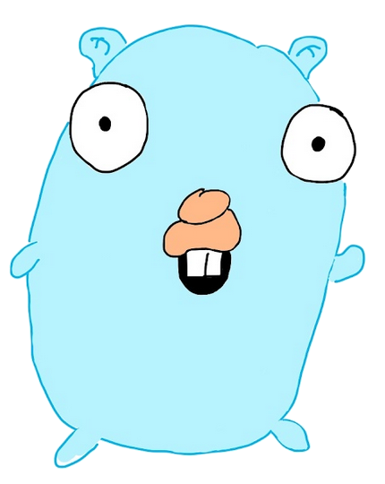

# Using your editor to fix Go

<!-- pause -->

Author: Tighearnán Carroll

<!-- end_slide -->

## What this talk is

A shallow showcase of dev tooling.

<!-- pause -->

Go is great, but not without valid issues.

Your editor is great, but not without features that you've never used.

Can we maybe use these features to paper over go's problems?

<!-- end_slide -->

## What this talk is

We will be using using Neovim and it's API, so there be more Lua than Golang.

However, nothing here is Neovim exclusive. If you run VSCode, any Intellij IDE, or any other editor with good plugin support, all of this will be possible.

<!-- end_slide -->

## What this talk isn't

<!-- pause -->


<!-- end_slide -->

## Problems with Go

<!-- pause -->



Golang, while good fun, has both features and issues that you need to warm to.

To pick one of these features (_**totally**_ at random), we'll look at implicit interface satisfaction.

<!-- end_slide -->

## Problems with Go

<!-- column_layout: [1, 1] -->

<!-- column: 0 -->

To quickly explain, if I have am expecting a _duck_:

```go
type Duck interface {
    Walk()
    Talk()
}
```

<!-- pause -->

<!-- column: 1 -->

A random animal comes along:

```go
type RandomAnimal struct {}
```

<!-- reset_layout -->

<!-- pause -->

<!-- column_layout: [1, 1] -->

<!-- column: 0 -->

That walks like a duck:

```go
func (RandomAnimal) Walk() {
    println("waddle waddle away")
}
```
<!-- pause -->

<!-- column: 1 -->

And talks like a duck:

```go
func (RandomAnimal) Talk() {
    println("do you sell any grapes?")
}
```

<!-- reset_layout -->

<!-- end_slide -->

## Problems with Go

Then as far as Golang is concerned, that animal is a duck:

```go
func serveCustomer(d Duck) {
    println("we only sell lemonade")
}

func main() {
    var r RandomAnimal
    serveCustomer(r)
}
```

<!-- end_slide -->

## Problems with Go

At no point, does `RandomAnimal` declare that it `implements` `Duck`, however it
does because it has implemented both of `Duck`'s methods.

```go
type Duck interface {
    Walk()
    Talk()
}

type RandomAnimal struct {}

func (RandomAnimal) Walk() {
    println("waddle waddle away")
}

func (RandomAnimal) Talk() {
    println("do you sell any grapes?")
}
```

<!-- pause -->

### Some folks hate this, because...

- It is impossible to know what a `type` implements at a glance.

- There is a belief that intention should be explicit.

<!-- end_slide -->

# Moving swiftly on...

<!--end_slide -->

Tools
-----

## Editor API

<!--end_slide -->

### Editor API

Your editor, assuming it's modern, has an extensive API that you can plug into.

These APIs are fantastic building blocks.

<!-- pause -->

Let's take a _random_ API, displaying virtual text.

<!-- end_slide -->

### Editor API

It's as easy as a few lines of code.

```lua
vim.api.nvim_buf_set_extmark(
    0,
    namespace, -- Editor specific detail
    line, -- Line to render the virtual text
    character, -- Anchor to character on line
    { -- editor specific options
        virt_text = {
            { "holyhell", "@highlight" },
        },
    }
)
```

<!-- end_slide -->

### Editor API

<!-- column_layout: [1, 1] -->

<!-- column: 0 -->

In a single function call, you can make this:


<!-- pause -->

<!-- column: 1 -->

Look like this:


<!-- reset_layout -->

<!-- end_slide -->

Tools uimhir a dó
-----------------

## The Language Server Protocol (LSP)

<!-- pause -->

A lot of your editor's convienient language features may not actually be
_editor_ features, and instead are implemented by your language's language
server.

<!-- pause -->

These include heavy hitting features like:

- Autocomplete
- Symbol renaming
- Jump to definition
- Code actions

<!-- end_slide -->

## The LSP

A language server is specific to a language.

- Golang has `gopls`

- Python has `pylsp`

- Typescript has `tsserver`

- Rust has `rust_anaylzer`

<!-- pause -->

All language servers are equal, but some are more equal than others.

With go, we are _blessed_ because `gopls` is best in class.

<!-- end_slide -->

## The LSP

A language server implements a series of JSON RPC functions adherring to a
specification.

Your editor implements a client to invoke these functions, also adherring to
this specification.

Your editor also typically spawns and manages the lifecycle of a language
server the when you start working in a project.

<!-- end_slide -->

## The LSP

### Go to definition


<!-- end_slide -->

## The LSP

### Rename


<!-- end_slide -->

## The LSP

Following the previous tool, your editor is very likely to extend an API to use
it's language server client which you can use in order to talk to your
language's language server.

<!-- end_slide -->

## The LSP

Demo
----

<!-- end_slide -->

Other Editors
-------------

#### In VSCode

- Both VSCode and the LSP specification have been created and are maintained by
  Microsoft. As a result, VSCode has arguably the most feature complete client.
  Written in Typescript.

#### In Intellij

- Use Red Hat's LSP client, as Intellij gate off their built-in client to paid tiers:

- [](https://github.com/redhat-developer/lsp4ij)

<!-- end_slide -->

## Tools part 3

Abstract syntax trees (AST)
---

ASTs, for the uninitiated, is just your program parsed to a tree of syntax that can be traversed, used for syntax highlighting, and queried.

We are going to focus on Tree Sitter, created by Max Brunsfeld during his time working on Atom.

Atom is dead, but tree-sitter lives on and we're in a better world for it.

<!-- end_slide -->

### ASTs

<!-- column_layout: [1, 1] -->

<!-- column: 0 -->

Take the following golang:

```go
func Holy(term string) string {
    if term == "hell" {
        return "google en passant"
    }
}
```

<!-- pause -->

<!-- column: 1 -->

The tree-sitter formatting of this snippet is:

```
(function_declaration
  name: (identifier)
  parameters: (parameter_list
    (parameter_declaration
    name: (identifier)
    type: (type_identifier)))
  result: (type_identifier)
  body: (block
    (if_statement
    condition: (binary_expression
      left: (identifier)
      right: (interpreted_string_literal))
    consequence: (block
      (return_statement
      (expression_list
        (interpreted_string_literal)))))))
```

<!-- reset_layout -->

<!-- end_slide -->

### ASTs

Demo
----

<!-- end_slide -->

Other Editors
-------------

#### In VSCode

Use the `tree-sitter` package on npm:

- https://www.npmjs.com/package/tree-sitter

- example: [](https://github.com/cucumber/language-service)

#### In Intellij

Use the `jsitter` plugin:

- https://github.com/JetBrains/jsitter

<!-- end_slide -->

Bringing it all together
------------------------

<!-- pause -->

Folks I've a confession to make. I've been lying to you all tonight.

<!-- pause -->

These weren't random examples.

<!-- pause -->

What if we used `tree-sitter` to query for all non-interface types, asked our
language server to tell us what those types implement, and then displayed those
results as virtual text?

<!-- end_slide -->

Live Coding Demo
----------------


